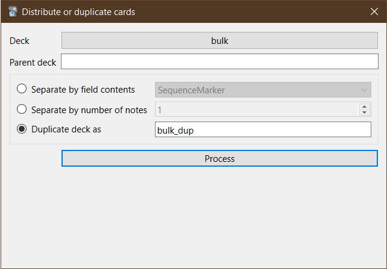

Anki add-on that distributes cards from a chosen deck to multiple decks according to a field's contents or by a maximum number of cards. It also has an option to duplicate cards.

The add-on's dialog can be accessed from the Tools menu.

There is also a "Duplicate" button under the gears icon besides deck names in the main screen.
